<p align="center">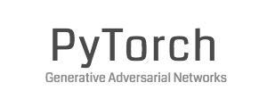</p>

## PyTorch-GAN
Collection of PyTorch implementations of Generative Adversarial Network varieties presented in research papers. Model architectures will not always mirror the ones proposed in the papers, but I have chosen to focus on getting the core ideas covered instead of getting every layer configuration right. Contributions and suggestions of GANs to implement are very welcomed.

<b>See also:</b> [Keras-GAN](https://github.com/eriklindernoren/Keras-GAN)

## Table of Contents
  * [Installation](#installation)
  * [Implementations](#implementations)
    + [Auxiliary Classifier GAN](#auxiliary-classifier-gan)
    + [Adversarial Autoencoder](#adversarial-autoencoder)
    + [BEGAN](#began)
    + [BicycleGAN](#bicyclegan)
    + [Boundary-Seeking GAN](#boundary-seeking-gan)
    + [Conditional GAN](#conditional-gan)
    + [Context-Conditional GAN](#context-conditional-gan)
    + [Context Encoder](#context-encoder)
    + [Coupled GAN](#coupled-gan)
    + [CycleGAN](#cyclegan)
    + [Deep Convolutional GAN](#deep-convolutional-gan)
    + [DiscoGAN](#discogan)
    + [DRAGAN](#dragan)
    + [DualGAN](#dualgan)
    + [Energy-Based GAN](#energy-based-gan)
    + [GAN](#gan)
    + [InfoGAN](#infogan)
    + [Least Squares GAN](#least-squares-gan)
    + [MUNIT](#munit)
    + [Pix2Pix](#pix2pix)
    + [PixelDA](#pixelda)
    + [Semi-Supervised GAN](#semi-supervised-gan)
    + [Softmax GAN](#softmax-gan)
    + [StarGAN](#stargan)
    + [Super-Resolution GAN](#super-resolution-gan)
    + [UNIT](#unit)
    + [Wasserstein GAN](#wasserstein-gan)
    + [Wasserstein GAN GP](#wasserstein-gan-gp)
    + [Wasserstein GAN DIV](#wasserstein-gan-div)

## Installation
    $ git clone https://github.com/eriklindernoren/PyTorch-GAN
    $ cd PyTorch-GAN/
    $ sudo pip3 install -r requirements.txt

## Implementations   
### Auxiliary Classifier GAN
_Auxiliary Classifier Generative Adversarial Network_

#### Authors
Augustus Odena, Christopher Olah, Jonathon Shlens

#### Abstract
Synthesizing high resolution photorealistic images has been a long-standing challenge in machine learning. In this paper we introduce new methods for the improved training of generative adversarial networks (GANs) for image synthesis. We construct a variant of GANs employing label conditioning that results in 128x128 resolution image samples exhibiting global coherence. We expand on previous work for image quality assessment to provide two new analyses for assessing the discriminability and diversity of samples from class-conditional image synthesis models. These analyses demonstrate that high resolution samples provide class information not present in low resolution samples. Across 1000 ImageNet classes, 128x128 samples are more than twice as discriminable as artificially resized 32x32 samples. In addition, 84.7% of the classes have samples exhibiting diversity comparable to real ImageNet data.

[[Paper]](https://arxiv.org/abs/1610.09585) [[Code]](implementations/acgan/acgan.py)

#### Run Example
```
$ cd implementations/acgan/
$ python3 acgan.py
```

<p align="center">
    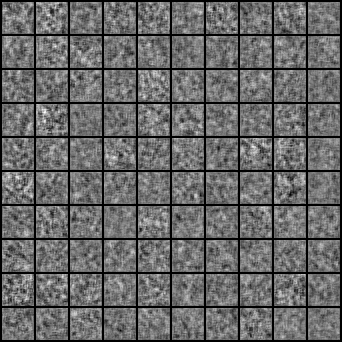
</p>

### Adversarial Autoencoder
_Adversarial Autoencoder_

#### Authors
Alireza Makhzani, Jonathon Shlens, Navdeep Jaitly, Ian Goodfellow, Brendan Frey

#### Abstract
n this paper, we propose the "adversarial autoencoder" (AAE), which is a probabilistic autoencoder that uses the recently proposed generative adversarial networks (GAN) to perform variational inference by matching the aggregated posterior of the hidden code vector of the autoencoder with an arbitrary prior distribution. Matching the aggregated posterior to the prior ensures that generating from any part of prior space results in meaningful samples. As a result, the decoder of the adversarial autoencoder learns a deep generative model that maps the imposed prior to the data distribution. We show how the adversarial autoencoder can be used in applications such as semi-supervised classification, disentangling style and content of images, unsupervised clustering, dimensionality reduction and data visualization. We performed experiments on MNIST, Street View House Numbers and Toronto Face datasets and show that adversarial autoencoders achieve competitive results in generative modeling and semi-supervised classification tasks.

[[Paper]](https://arxiv.org/abs/1511.05644) [[Code]](implementations/aae/aae.py)

#### Run Example
```
$ cd implementations/aae/
$ python3 aae.py
```

### BEGAN
_BEGAN: Boundary Equilibrium Generative Adversarial Networks_

#### Authors
David Berthelot, Thomas Schumm, Luke Metz

#### Abstract
We propose a new equilibrium enforcing method paired with a loss derived from the Wasserstein distance for training auto-encoder based Generative Adversarial Networks. This method balances the generator and discriminator during training. Additionally, it provides a new approximate convergence measure, fast and stable training and high visual quality. We also derive a way of controlling the trade-off between image diversity and visual quality. We focus on the image generation task, setting a new milestone in visual quality, even at higher resolutions. This is achieved while using a relatively simple model architecture and a standard training procedure.

[[Paper]](https://arxiv.org/abs/1703.10717) [[Code]](implementations/began/began.py)

#### Run Example
```
$ cd implementations/began/
$ python3 began.py
```

### BicycleGAN
_Toward Multimodal Image-to-Image Translation_

#### Authors
Jun-Yan Zhu, Richard Zhang, Deepak Pathak, Trevor Darrell, Alexei A. Efros, Oliver Wang, Eli Shechtman

#### Abstract
Many image-to-image translation problems are ambiguous, as a single input image may correspond to multiple possible outputs. In this work, we aim to model a \emph{distribution} of possible outputs in a conditional generative modeling setting. The ambiguity of the mapping is distilled in a low-dimensional latent vector, which can be randomly sampled at test time. A generator learns to map the given input, combined with this latent code, to the output. We explicitly encourage the connection between output and the latent code to be invertible. This helps prevent a many-to-one mapping from the latent code to the output during training, also known as the problem of mode collapse, and produces more diverse results. We explore several variants of this approach by employing different training objectives, network architectures, and methods of injecting the latent code. Our proposed method encourages bijective consistency between the latent encoding and output modes. We present a systematic comparison of our method and other variants on both perceptual realism and diversity.

[[Paper]](https://arxiv.org/abs/1711.11586) [[Code]](implementations/bicyclegan/bicyclegan.py)

#### Run Example
```
$ cd data/
$ bash download_pix2pix_dataset.sh edges2shoes
$ cd ../implementations/bicyclegan/
$ python3 bicyclegan.py
```

### Boundary-Seeking GAN
_Boundary-Seeking Generative Adversarial Networks_

#### Authors
R Devon Hjelm, Athul Paul Jacob, Tong Che, Adam Trischler, Kyunghyun Cho, Yoshua Bengio

#### Abstract
Generative adversarial networks (GANs) are a learning framework that rely on training a discriminator to estimate a measure of difference between a target and generated distributions. GANs, as normally formulated, rely on the generated samples being completely differentiable w.r.t. the generative parameters, and thus do not work for discrete data. We introduce a method for training GANs with discrete data that uses the estimated difference measure from the discriminator to compute importance weights for generated samples, thus providing a policy gradient for training the generator. The importance weights have a strong connection to the decision boundary of the discriminator, and we call our method boundary-seeking GANs (BGANs). We demonstrate the effectiveness of the proposed algorithm with discrete image and character-based natural language generation. In addition, the boundary-seeking objective extends to continuous data, which can be used to improve stability of training, and we demonstrate this on Celeba, Large-scale Scene Understanding (LSUN) bedrooms, and Imagenet without conditioning.

[[Paper]](https://arxiv.org/abs/1702.08431) [[Code]](implementations/bgan/bgan.py)

#### Run Example
```
$ cd implementations/bgan/
$ python3 bgan.py
```

### Conditional GAN
_Conditional Generative Adversarial Nets_

#### Authors
Mehdi Mirza, Simon Osindero

#### Abstract
Generative Adversarial Nets [8] were recently introduced as a novel way to train generative models. In this work we introduce the conditional version of generative adversarial nets, which can be constructed by simply feeding the data, y, we wish to condition on to both the generator and discriminator. We show that this model can generate MNIST digits conditioned on class labels. We also illustrate how this model could be used to learn a multi-modal model, and provide preliminary examples of an application to image tagging in which we demonstrate how this approach can generate descriptive tags which are not part of training labels.

[[Paper]](https://arxiv.org/abs/1411.1784) [[Code]](implementations/cgan/cgan.py)

#### Run Example
```
$ cd implementations/cgan/
$ python3 cgan.py
```

<p align="center">
    
</p>

### Context-Conditional GAN
_Semi-Supervised Learning with Context-Conditional Generative Adversarial Networks_

#### Authors
Emily Denton, Sam Gross, Rob Fergus

#### Abstract
We introduce a simple semi-supervised learning approach for images based on in-painting using an adversarial loss. Images with random patches removed are presented to a generator whose task is to fill in the hole, based on the surrounding pixels. The in-painted images are then presented to a discriminator network that judges if they are real (unaltered training images) or not. This task acts as a regularizer for standard supervised training of the discriminator. Using our approach we are able to directly train large VGG-style networks in a semi-supervised fashion. We evaluate on STL-10 and PASCAL datasets, where our approach obtains performance comparable or superior to existing methods.

[[Paper]](https://arxiv.org/abs/1611.06430) [[Code]](implementations/ccgan/ccgan.py)

#### Run Example
```
$ cd implementations/ccgan/
$ python3 ccgan.py
```

### Context Encoder
_Context Encoders: Feature Learning by Inpainting_

#### Authors
Deepak Pathak, Philipp Krahenbuhl, Jeff Donahue, Trevor Darrell, Alexei A. Efros

#### Abstract
We present an unsupervised visual feature learning algorithm driven by context-based pixel prediction. By analogy with auto-encoders, we propose Context Encoders -- a convolutional neural network trained to generate the contents of an arbitrary image region conditioned on its surroundings. In order to succeed at this task, context encoders need to both understand the content of the entire image, as well as produce a plausible hypothesis for the missing part(s). When training context encoders, we have experimented with both a standard pixel-wise reconstruction loss, as well as a reconstruction plus an adversarial loss. The latter produces much sharper results because it can better handle multiple modes in the output. We found that a context encoder learns a representation that captures not just appearance but also the semantics of visual structures. We quantitatively demonstrate the effectiveness of our learned features for CNN pre-training on classification, detection, and segmentation tasks. Furthermore, context encoders can be used for semantic inpainting tasks, either stand-alone or as initialization for non-parametric methods.

[[Paper]](https://arxiv.org/abs/1604.07379) [[Code]](implementations/context_encoder/context_encoder.py)

#### Run Example
```
$ cd implementations/context_encoder/
<follow steps at the top of context_encoder.py>
$ python3 context_encoder.py
```

<p align="center">
    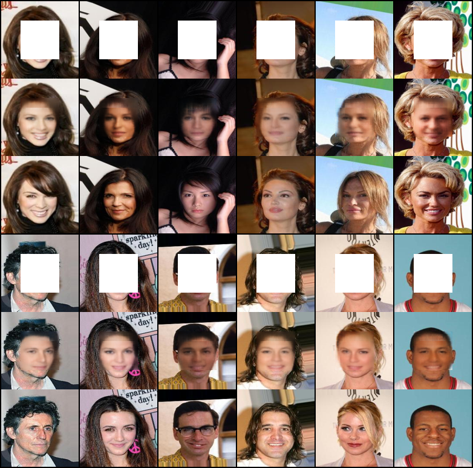
</p>
<p align="center">
    Rows: Masked | Inpainted | Original | Masked | Inpainted | Original
</p>

### Coupled GAN
_Coupled Generative Adversarial Networks_

#### Authors
Ming-Yu Liu, Oncel Tuzel

#### Abstract
We propose coupled generative adversarial network (CoGAN) for learning a joint distribution of multi-domain images. In contrast to the existing approaches, which require tuples of corresponding images in different domains in the training set, CoGAN can learn a joint distribution without any tuple of corresponding images. It can learn a joint distribution with just samples drawn from the marginal distributions. This is achieved by enforcing a weight-sharing constraint that limits the network capacity and favors a joint distribution solution over a product of marginal distributions one. We apply CoGAN to several joint distribution learning tasks, including learning a joint distribution of color and depth images, and learning a joint distribution of face images with different attributes. For each task it successfully learns the joint distribution without any tuple of corresponding images. We also demonstrate its applications to domain adaptation and image transformation.

[[Paper]](https://arxiv.org/abs/1606.07536) [[Code]](implementations/cogan/cogan.py)

#### Run Example
```
$ cd implementations/cogan/
$ python3 cogan.py
```

<p align="center">
    
</p>
<p align="center">
    Generated MNIST and MNIST-M images
</p>

### CycleGAN
_Unpaired Image-to-Image Translation using Cycle-Consistent Adversarial Networks_

#### Authors
Jun-Yan Zhu, Taesung Park, Phillip Isola, Alexei A. Efros

#### Abstract
Image-to-image translation is a class of vision and graphics problems where the goal is to learn the mapping between an input image and an output image using a training set of aligned image pairs. However, for many tasks, paired training data will not be available. We present an approach for learning to translate an image from a source domain X to a target domain Y in the absence of paired examples. Our goal is to learn a mapping G:X→Y such that the distribution of images from G(X) is indistinguishable from the distribution Y using an adversarial loss. Because this mapping is highly under-constrained, we couple it with an inverse mapping F:Y→X and introduce a cycle consistency loss to push F(G(X))≈X (and vice versa). Qualitative results are presented on several tasks where paired training data does not exist, including collection style transfer, object transfiguration, season transfer, photo enhancement, etc. Quantitative comparisons against several prior methods demonstrate the superiority of our approach.

[[Paper]](https://arxiv.org/abs/1703.10593) [[Code]](implementations/cyclegan/cyclegan.py)

<p align="center">
    
</p>

#### Run Example
```
$ cd data/
$ bash download_cyclegan_dataset.sh monet2photo
$ cd ../implementations/cyclegan/
$ python3 cyclegan.py --dataset_name monet2photo
```

<p align="center">
    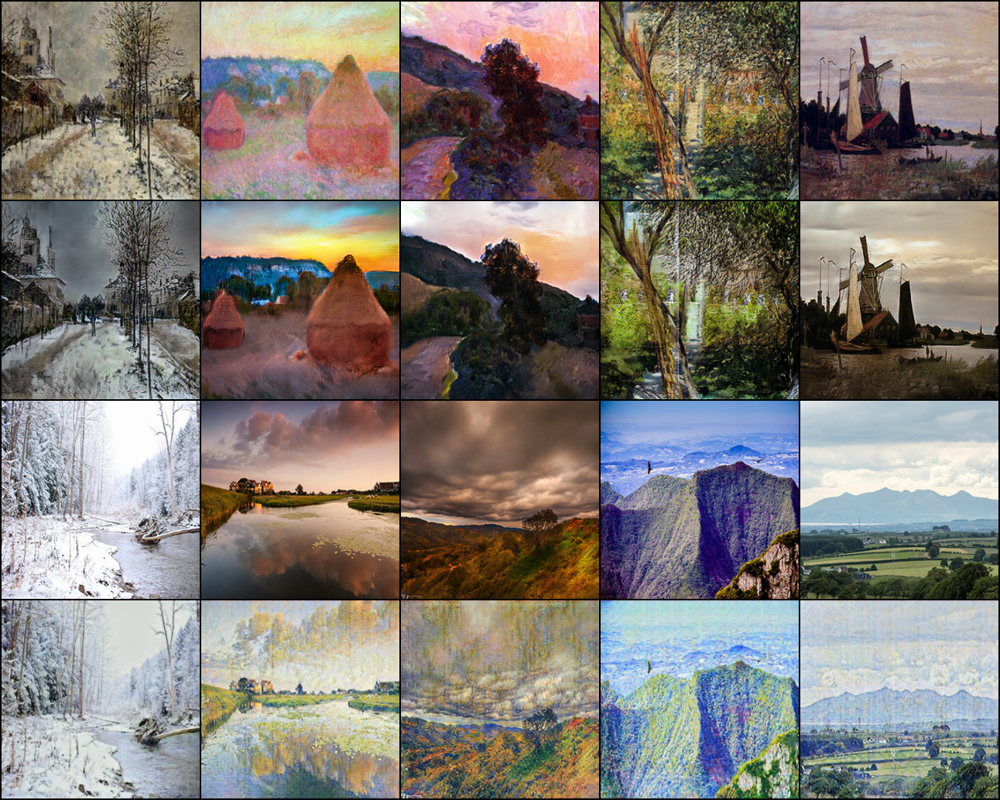
</p>
<p align="center">
    Monet to photo translations.
</p>

### Deep Convolutional GAN
_Deep Convolutional Generative Adversarial Network_

#### Authors
Alec Radford, Luke Metz, Soumith Chintala

#### Abstract
In recent years, supervised learning with convolutional networks (CNNs) has seen huge adoption in computer vision applications. Comparatively, unsupervised learning with CNNs has received less attention. In this work we hope to help bridge the gap between the success of CNNs for supervised learning and unsupervised learning. We introduce a class of CNNs called deep convolutional generative adversarial networks (DCGANs), that have certain architectural constraints, and demonstrate that they are a strong candidate for unsupervised learning. Training on various image datasets, we show convincing evidence that our deep convolutional adversarial pair learns a hierarchy of representations from object parts to scenes in both the generator and discriminator. Additionally, we use the learned features for novel tasks - demonstrating their applicability as general image representations.

[[Paper]](https://arxiv.org/abs/1511.06434) [[Code]](implementations/dcgan/dcgan.py)

#### Run Example
```
$ cd implementations/dcgan/
$ python3 dcgan.py
```

<p align="center">
    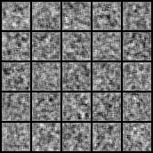
</p>

### DiscoGAN
_Learning to Discover Cross-Domain Relations with Generative Adversarial Networks_

#### Authors
Taeksoo Kim, Moonsu Cha, Hyunsoo Kim, Jung Kwon Lee, Jiwon Kim

#### Abstract
While humans easily recognize relations between data from different domains without any supervision, learning to automatically discover them is in general very challenging and needs many ground-truth pairs that illustrate the relations. To avoid costly pairing, we address the task of discovering cross-domain relations given unpaired data. We propose a method based on generative adversarial networks that learns to discover relations between different domains (DiscoGAN). Using the discovered relations, our proposed network successfully transfers style from one domain to another while preserving key attributes such as orientation and face identity.

[[Paper]](https://arxiv.org/abs/1703.05192) [[Code]](implementations/discogan/discogan.py)

<p align="center">
    
</p>

#### Run Example
```
$ cd data/
$ bash download_pix2pix_dataset.sh edges2shoes
$ cd ../implementations/discogan/
$ python3 discogan.py --dataset_name edges2shoes
```

<p align="center">
    
</p>
<p align="center">
    Rows from top to bottom: (1) Real image from domain A (2) Translated image from <br>
    domain A (3) Reconstructed image from domain A (4) Real image from domain B (5) <br>
    Translated image from domain B (6) Reconstructed image from domain B
</p>

### DRAGAN
_On Convergence and Stability of GANs_

#### Authors
Naveen Kodali, Jacob Abernethy, James Hays, Zsolt Kira

#### Abstract
We propose studying GAN training dynamics as regret minimization, which is in contrast to the popular view that there is consistent minimization of a divergence between real and generated distributions. We analyze the convergence of GAN training from this new point of view to understand why mode collapse happens. We hypothesize the existence of undesirable local equilibria in this non-convex game to be responsible for mode collapse. We observe that these local equilibria often exhibit sharp gradients of the discriminator function around some real data points. We demonstrate that these degenerate local equilibria can be avoided with a gradient penalty scheme called DRAGAN. We show that DRAGAN enables faster training, achieves improved stability with fewer mode collapses, and leads to generator networks with better modeling performance across a variety of architectures and objective functions.

[[Paper]](https://arxiv.org/abs/1705.07215) [[Code]](implementations/dragan/dragan.py)

#### Run Example
```
$ cd implementations/dragan/
$ python3 dragan.py
```

### DualGAN
_DualGAN: Unsupervised Dual Learning for Image-to-Image Translation_

#### Authors
Zili Yi, Hao Zhang, Ping Tan, Minglun Gong

#### Abstract
Conditional Generative Adversarial Networks (GANs) for cross-domain image-to-image translation have made much progress recently. Depending on the task complexity, thousands to millions of labeled image pairs are needed to train a conditional GAN. However, human labeling is expensive, even impractical, and large quantities of data may not always be available. Inspired by dual learning from natural language translation, we develop a novel dual-GAN mechanism, which enables image translators to be trained from two sets of unlabeled images from two domains. In our architecture, the primal GAN learns to translate images from domain U to those in domain V, while the dual GAN learns to invert the task. The closed loop made by the primal and dual tasks allows images from either domain to be translated and then reconstructed. Hence a loss function that accounts for the reconstruction error of images can be used to train the translators. Experiments on multiple image translation tasks with unlabeled data show considerable performance gain of DualGAN over a single GAN. For some tasks, DualGAN can even achieve comparable or slightly better results than conditional GAN trained on fully labeled data.

[[Paper]](https://arxiv.org/abs/1704.02510) [[Code]](implementations/dualgan/dualgan.py)


#### Run Example
```
$ cd data/
$ bash download_pix2pix_dataset.sh facades
$ cd ../implementations/dualgan/
$ python3 dualgan.py --dataset_name facades
```

### Energy-Based GAN
_Energy-based Generative Adversarial Network_

#### Authors
Junbo Zhao, Michael Mathieu, Yann LeCun

#### Abstract
We introduce the "Energy-based Generative Adversarial Network" model (EBGAN) which views the discriminator as an energy function that attributes low energies to the regions near the data manifold and higher energies to other regions. Similar to the probabilistic GANs, a generator is seen as being trained to produce contrastive samples with minimal energies, while the discriminator is trained to assign high energies to these generated samples. Viewing the discriminator as an energy function allows to use a wide variety of architectures and loss functionals in addition to the usual binary classifier with logistic output. Among them, we show one instantiation of EBGAN framework as using an auto-encoder architecture, with the energy being the reconstruction error, in place of the discriminator. We show that this form of EBGAN exhibits more stable behavior than regular GANs during training. We also show that a single-scale architecture can be trained to generate high-resolution images.

[[Paper]](https://arxiv.org/abs/1609.03126) [[Code]](implementations/ebgan/ebgan.py)

#### Run Example
```
$ cd implementations/ebgan/
$ python3 ebgan.py
```

### GAN
_Generative Adversarial Network_

#### Authors
Ian J. Goodfellow, Jean Pouget-Abadie, Mehdi Mirza, Bing Xu, David Warde-Farley, Sherjil Ozair, Aaron Courville, Yoshua Bengio

#### Abstract
We propose a new framework for estimating generative models via an adversarial process, in which we simultaneously train two models: a generative model G that captures the data distribution, and a discriminative model D that estimates the probability that a sample came from the training data rather than G. The training procedure for G is to maximize the probability of D making a mistake. This framework corresponds to a minimax two-player game. In the space of arbitrary functions G and D, a unique solution exists, with G recovering the training data distribution and D equal to 1/2 everywhere. In the case where G and D are defined by multilayer perceptrons, the entire system can be trained with backpropagation. There is no need for any Markov chains or unrolled approximate inference networks during either training or generation of samples. Experiments demonstrate the potential of the framework through qualitative and quantitative evaluation of the generated samples.

[[Paper]](https://arxiv.org/abs/1406.2661) [[Code]](implementations/gan/gan.py)

#### Run Example
```
$ cd implementations/gan/
$ python3 gan.py
```

<p align="center">
    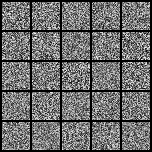
</p>

### InfoGAN
_InfoGAN: Interpretable Representation Learning by Information Maximizing Generative Adversarial Nets_

#### Authors
Xi Chen, Yan Duan, Rein Houthooft, John Schulman, Ilya Sutskever, Pieter Abbeel

#### Abstract
This paper describes InfoGAN, an information-theoretic extension to the Generative Adversarial Network that is able to learn disentangled representations in a completely unsupervised manner. InfoGAN is a generative adversarial network that also maximizes the mutual information between a small subset of the latent variables and the observation. We derive a lower bound to the mutual information objective that can be optimized efficiently, and show that our training procedure can be interpreted as a variation of the Wake-Sleep algorithm. Specifically, InfoGAN successfully disentangles writing styles from digit shapes on the MNIST dataset, pose from lighting of 3D rendered images, and background digits from the central digit on the SVHN dataset. It also discovers visual concepts that include hair styles, presence/absence of eyeglasses, and emotions on the CelebA face dataset. Experiments show that InfoGAN learns interpretable representations that are competitive with representations learned by existing fully supervised methods.

[[Paper]](https://arxiv.org/abs/1606.03657) [[Code]](implementations/infogan/infogan.py)

#### Run Example
```
$ cd implementations/infogan/
$ python3 infogan.py
```

<p align="center">
    
</p>
<p align="center">
    Result of varying categorical latent variable by column.
</p>

<p align="center">
    
</p>
<p align="center">
    Result of varying continuous latent variable by row.
</p>

### Least Squares GAN
_Least Squares Generative Adversarial Networks_

#### Authors
Xudong Mao, Qing Li, Haoran Xie, Raymond Y.K. Lau, Zhen Wang, Stephen Paul Smolley

#### Abstract
Unsupervised learning with generative adversarial networks (GANs) has proven hugely successful. Regular GANs hypothesize the discriminator as a classifier with the sigmoid cross entropy loss function. However, we found that this loss function may lead to the vanishing gradients problem during the learning process. To overcome such a problem, we propose in this paper the Least Squares Generative Adversarial Networks (LSGANs) which adopt the least squares loss function for the discriminator. We show that minimizing the objective function of LSGAN yields minimizing the Pearson χ2 divergence. There are two benefits of LSGANs over regular GANs. First, LSGANs are able to generate higher quality images than regular GANs. Second, LSGANs perform more stable during the learning process. We evaluate LSGANs on five scene datasets and the experimental results show that the images generated by LSGANs are of better quality than the ones generated by regular GANs. We also conduct two comparison experiments between LSGANs and regular GANs to illustrate the stability of LSGANs.

[[Paper]](https://arxiv.org/abs/1611.04076) [[Code]](implementations/lsgan/lsgan.py)

#### Run Example
```
$ cd implementations/lsgan/
$ python3 lsgan.py
```


### MUNIT
_Multimodal Unsupervised Image-to-Image Translation_

#### Authors
Xun Huang, Ming-Yu Liu, Serge Belongie, Jan Kautz

#### Abstract
Unsupervised image-to-image translation is an important and challenging problem in computer vision. Given an image in the source domain, the goal is to learn the conditional distribution of corresponding images in the target domain, without seeing any pairs of corresponding images. While this conditional distribution is inherently multimodal, existing approaches make an overly simplified assumption, modeling it as a deterministic one-to-one mapping. As a result, they fail to generate diverse outputs from a given source domain image. To address this limitation, we propose a Multimodal Unsupervised Image-to-image Translation (MUNIT) framework. We assume that the image representation can be decomposed into a content code that is domain-invariant, and a style code that captures domain-specific properties. To translate an image to another domain, we recombine its content code with a random style code sampled from the style space of the target domain. We analyze the proposed framework and establish several theoretical results. Extensive experiments with comparisons to the state-of-the-art approaches further demonstrates the advantage of the proposed framework. Moreover, our framework allows users to control the style of translation outputs by providing an example style image. Code and pretrained models are available at [this https URL](https://github.com/nvlabs/MUNIT)

[[Paper]](https://arxiv.org/abs/1804.04732) [[Code]](implementations/munit/munit.py)

#### Run Example
```
$ cd data/
$ bash download_pix2pix_dataset.sh edges2shoes
$ cd ../implementations/munit/
$ python3 munit.py --dataset_name edges2shoes
```

### Pix2Pix
_Unpaired Image-to-Image Translation with Conditional Adversarial Networks_

#### Authors
Phillip Isola, Jun-Yan Zhu, Tinghui Zhou, Alexei A. Efros

#### Abstract
We investigate conditional adversarial networks as a general-purpose solution to image-to-image translation problems. These networks not only learn the mapping from input image to output image, but also learn a loss function to train this mapping. This makes it possible to apply the same generic approach to problems that traditionally would require very different loss formulations. We demonstrate that this approach is effective at synthesizing photos from label maps, reconstructing objects from edge maps, and colorizing images, among other tasks. Indeed, since the release of the pix2pix software associated with this paper, a large number of internet users (many of them artists) have posted their own experiments with our system, further demonstrating its wide applicability and ease of adoption without the need for parameter tweaking. As a community, we no longer hand-engineer our mapping functions, and this work suggests we can achieve reasonable results without hand-engineering our loss functions either.

[[Paper]](https://arxiv.org/abs/1611.07004) [[Code]](implementations/pix2pix/pix2pix.py)

<p align="center">
    
</p>

#### Run Example
```
$ cd data/
$ bash download_pix2pix_dataset.sh facades
$ cd ../implementations/pix2pix/
$ python3 pix2pix.py --dataset_name facades
```

<p align="center">
    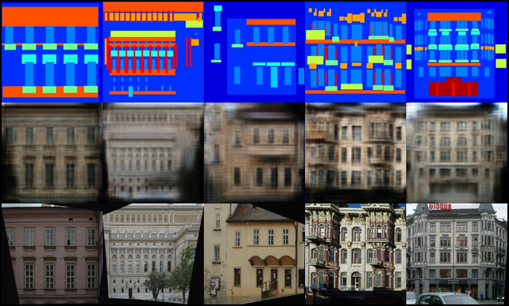
</p>
<p align="center">
    Rows from top to bottom: (1) The condition for the generator (2) Generated image <br>
    based of condition (3) The true corresponding image to the condition
</p>

### PixelDA
_Unsupervised Pixel-Level Domain Adaptation with Generative Adversarial Networks_

#### Authors
Konstantinos Bousmalis, Nathan Silberman, David Dohan, Dumitru Erhan, Dilip Krishnan

#### Abstract
Collecting well-annotated image datasets to train modern machine learning algorithms is prohibitively expensive for many tasks. One appealing alternative is rendering synthetic data where ground-truth annotations are generated automatically. Unfortunately, models trained purely on rendered images often fail to generalize to real images. To address this shortcoming, prior work introduced unsupervised domain adaptation algorithms that attempt to map representations between the two domains or learn to extract features that are domain-invariant. In this work, we present a new approach that learns, in an unsupervised manner, a transformation in the pixel space from one domain to the other. Our generative adversarial network (GAN)-based method adapts source-domain images to appear as if drawn from the target domain. Our approach not only produces plausible samples, but also outperforms the state-of-the-art on a number of unsupervised domain adaptation scenarios by large margins. Finally, we demonstrate that the adaptation process generalizes to object classes unseen during training.

[[Paper]](https://arxiv.org/abs/1612.05424) [[Code]](implementations/pixelda/pixelda.py)

#### MNIST to MNIST-M Classification
Trains a classifier on images that have been translated from the source domain (MNIST) to the target domain (MNIST-M) using the annotations of the source domain images. The classification network is trained jointly with the generator network to optimize the generator for both providing a proper domain translation and also for preserving the semantics of the source domain image. The classification network trained on translated images is compared to the naive solution of training a classifier on MNIST and evaluating it on MNIST-M. The naive model manages a 55% classification accuracy on MNIST-M while the one trained during domain adaptation achieves a 95% classification accuracy.

```
$ cd implementations/pixelda/
$ python3 pixelda.py
```  
| Method       | Accuracy  |
| ------------ |:---------:|
| Naive        | 55%       |
| PixelDA      | 95%       |

<p align="center">
    
</p>
<p align="center">
    Rows from top to bottom: (1) Real images from MNIST (2) Translated images from <br>
    MNIST to MNIST-M (3) Examples of images from MNIST-M
</p>

### Semi-Supervised GAN
_Semi-Supervised Generative Adversarial Network_

#### Authors
Augustus Odena

#### Abstract
We extend Generative Adversarial Networks (GANs) to the semi-supervised context by forcing the discriminator network to output class labels. We train a generative model G and a discriminator D on a dataset with inputs belonging to one of N classes. At training time, D is made to predict which of N+1 classes the input belongs to, where an extra class is added to correspond to the outputs of G. We show that this method can be used to create a more data-efficient classifier and that it allows for generating higher quality samples than a regular GAN.

[[Paper]](https://arxiv.org/abs/1606.01583) [[Code]](implementations/sgan/sgan.py)

#### Run Example
```
$ cd implementations/sgan/
$ python3 sgan.py
```

### Softmax GAN
_Softmax GAN_

#### Authors
Min Lin

#### Abstract
Softmax GAN is a novel variant of Generative Adversarial Network (GAN). The key idea of Softmax GAN is to replace the classification loss in the original GAN with a softmax cross-entropy loss in the sample space of one single batch. In the adversarial learning of N real training samples and M generated samples, the target of discriminator training is to distribute all the probability mass to the real samples, each with probability 1M, and distribute zero probability to generated data. In the generator training phase, the target is to assign equal probability to all data points in the batch, each with probability 1M+N. While the original GAN is closely related to Noise Contrastive Estimation (NCE), we show that Softmax GAN is the Importance Sampling version of GAN. We futher demonstrate with experiments that this simple change stabilizes GAN training.

[[Paper]](https://arxiv.org/abs/1704.06191) [[Code]](implementations/softmax_gan/softmax_gan.py)

#### Run Example
```
$ cd implementations/softmax_gan/
$ python3 softmax_gan.py
```

### StarGAN
_StarGAN: Unified Generative Adversarial Networks for Multi-Domain Image-to-Image Translation_

#### Authors
Yunjey Choi, Minje Choi, Munyoung Kim, Jung-Woo Ha, Sunghun Kim, Jaegul Choo

#### Abstract
Recent studies have shown remarkable success in image-to-image translation for two domains. However, existing approaches have limited scalability and robustness in handling more than two domains, since different models should be built independently for every pair of image domains. To address this limitation, we propose StarGAN, a novel and scalable approach that can perform image-to-image translations for multiple domains using only a single model. Such a unified model architecture of StarGAN allows simultaneous training of multiple datasets with different domains within a single network. This leads to StarGAN's superior quality of translated images compared to existing models as well as the novel capability of flexibly translating an input image to any desired target domain. We empirically demonstrate the effectiveness of our approach on a facial attribute transfer and a facial expression synthesis tasks.

[[Paper]](https://arxiv.org/abs/1711.09020) [[Code]](implementations/stargan/stargan.py)

#### Run Example
```
$ cd implementations/stargan/
<follow steps at the top of stargan.py>
$ python3 stargan.py
```

<p align="center">
    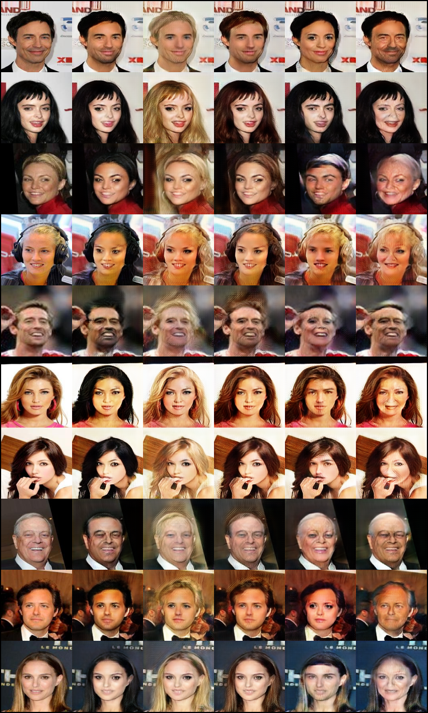
</p>
<p align="center">
    Original | Black Hair | Blonde Hair | Brown Hair | Gender Flip | Aged
</p>

### Super-Resolution GAN
_Photo-Realistic Single Image Super-Resolution Using a Generative Adversarial Network_

#### Authors
Christian Ledig, Lucas Theis, Ferenc Huszar, Jose Caballero, Andrew Cunningham, Alejandro Acosta, Andrew Aitken, Alykhan Tejani, Johannes Totz, Zehan Wang, Wenzhe Shi

#### Abstract
Despite the breakthroughs in accuracy and speed of single image super-resolution using faster and deeper convolutional neural networks, one central problem remains largely unsolved: how do we recover the finer texture details when we super-resolve at large upscaling factors? The behavior of optimization-based super-resolution methods is principally driven by the choice of the objective function. Recent work has largely focused on minimizing the mean squared reconstruction error. The resulting estimates have high peak signal-to-noise ratios, but they are often lacking high-frequency details and are perceptually unsatisfying in the sense that they fail to match the fidelity expected at the higher resolution. In this paper, we present SRGAN, a generative adversarial network (GAN) for image super-resolution (SR). To our knowledge, it is the first framework capable of inferring photo-realistic natural images for 4x upscaling factors. To achieve this, we propose a perceptual loss function which consists of an adversarial loss and a content loss. The adversarial loss pushes our solution to the natural image manifold using a discriminator network that is trained to differentiate between the super-resolved images and original photo-realistic images. In addition, we use a content loss motivated by perceptual similarity instead of similarity in pixel space. Our deep residual network is able to recover photo-realistic textures from heavily downsampled images on public benchmarks. An extensive mean-opinion-score (MOS) test shows hugely significant gains in perceptual quality using SRGAN. The MOS scores obtained with SRGAN are closer to those of the original high-resolution images than to those obtained with any state-of-the-art method.

[[Paper]](https://arxiv.org/abs/1609.04802) [[Code]](implementations/srgan/srgan.py)

<p align="center">
    
</p>

#### Run Example
```
$ cd implementations/srgan/
<follow steps at the top of srgan.py>
$ python3 srgan.py
```

<p align="center">
    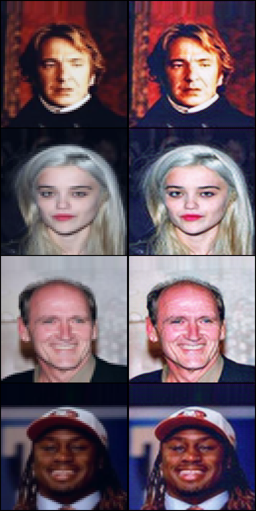
</p>
<p align="center">
    Rows from top to bottom: (1) Generated sample by Super-resolution GAN (2) The full <br>
    resolution image
</p>

### UNIT
_Unsupervised Image-to-Image Translation Networks_

#### Authors
Ming-Yu Liu, Thomas Breuel, Jan Kautz

#### Abstract
Unsupervised image-to-image translation aims at learning a joint distribution of images in different domains by using images from the marginal distributions in individual domains. Since there exists an infinite set of joint distributions that can arrive the given marginal distributions, one could infer nothing about the joint distribution from the marginal distributions without additional assumptions. To address the problem, we make a shared-latent space assumption and propose an unsupervised image-to-image translation framework based on Coupled GANs. We compare the proposed framework with competing approaches and present high quality image translation results on various challenging unsupervised image translation tasks, including street scene image translation, animal image translation, and face image translation. We also apply the proposed framework to domain adaptation and achieve state-of-the-art performance on benchmark datasets. Code and additional results are available in this [https URL](https://github.com/mingyuliutw/unit).

[[Paper]](https://arxiv.org/abs/1703.00848) [[Code]](implementations/unit/unit.py)

#### Run Example
```
$ cd data/
$ bash download_cyclegan_dataset.sh apple2orange
$ cd implementations/unit/
$ python3 unit.py --dataset_name apple2orange
```

### Wasserstein GAN
_Wasserstein GAN_

#### Authors
Martin Arjovsky, Soumith Chintala, Léon Bottou

#### Abstract
We introduce a new algorithm named WGAN, an alternative to traditional GAN training. In this new model, we show that we can improve the stability of learning, get rid of problems like mode collapse, and provide meaningful learning curves useful for debugging and hyperparameter searches. Furthermore, we show that the corresponding optimization problem is sound, and provide extensive theoretical work highlighting the deep connections to other distances between distributions.

[[Paper]](https://arxiv.org/abs/1701.07875) [[Code]](implementations/wgan/wgan.py)

#### Run Example
```
$ cd implementations/wgan/
$ python3 wgan.py
```

### Wasserstein GAN GP
_Improved Training of Wasserstein GANs_

#### Authors
Ishaan Gulrajani, Faruk Ahmed, Martin Arjovsky, Vincent Dumoulin, Aaron Courville

#### Abstract
Generative Adversarial Networks (GANs) are powerful generative models, but suffer from training instability. The recently proposed Wasserstein GAN (WGAN) makes progress toward stable training of GANs, but sometimes can still generate only low-quality samples or fail to converge. We find that these problems are often due to the use of weight clipping in WGAN to enforce a Lipschitz constraint on the critic, which can lead to undesired behavior. We propose an alternative to clipping weights: penalize the norm of gradient of the critic with respect to its input. Our proposed method performs better than standard WGAN and enables stable training of a wide variety of GAN architectures with almost no hyperparameter tuning, including 101-layer ResNets and language models over discrete data. We also achieve high quality generations on CIFAR-10 and LSUN bedrooms.

[[Paper]](https://arxiv.org/abs/1704.00028) [[Code]](implementations/wgan_gp/wgan_gp.py)

#### Run Example
```
$ cd implementations/wgan_gp/
$ python3 wgan_gp.py
```

<p align="center">
    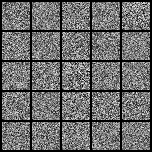
</p>

### Wasserstein GAN DIV
_Wasserstein Divergence for GANs_

#### Authors
Jiqing Wu, Zhiwu Huang, Janine Thoma, Dinesh Acharya, Luc Van Gool

#### Abstract
In many domains of computer vision, generative adversarial networks (GANs) have achieved great success, among which the fam-
ily of Wasserstein GANs (WGANs) is considered to be state-of-the-art due to the theoretical contributions and competitive qualitative performance. However, it is very challenging to approximate the k-Lipschitz constraint required by the Wasserstein-1 metric (W-met). In this paper, we propose a novel Wasserstein divergence (W-div), which is a relaxed version of W-met and does not require the k-Lipschitz constraint.As a concrete application, we introduce a Wasserstein divergence objective for GANs (WGAN-div), which can faithfully approximate W-div through optimization. Under various settings, including progressive growing training, we demonstrate the stability of the proposed WGAN-div owing to its theoretical and practical advantages over WGANs. Also, we study the quantitative and visual performance of WGAN-div on standard image synthesis benchmarks, showing the superior performance of WGAN-div compared to the state-of-the-art methods.

[[Paper]](https://arxiv.org/abs/1712.01026) [[Code]](implementations/wgan_div/wgan_div.py)

#### Run Example
```
$ cd implementations/wgan_div/
$ python3 wgan_div.py
```

<p align="center">
    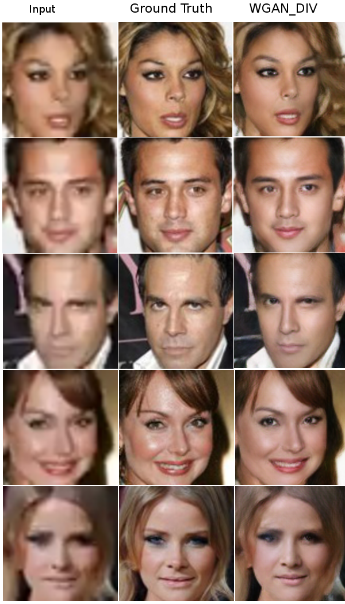
</p>
